# Fabric, Meta Data and KQL Magic from REST APIs to Insights

###  Authors
Kristian Bubalo & Meinrad Weiss, Cloud Solution Architects, Microsoft Switzerland

https://msevents.microsoft.com/event?id=3784259392

## Overview

###  Requirement and Solution

Reference application with the goal of implementing a scalable and maintainable architecture, close to a real project, that optimally utilizes the strengths of the used fabric services (write as few code as necessary).

For "training purposes, and time limit" we have made some adjustments to the architecture in different areas, such as:
- Using human readable keys in the meta data database
- Transmitting JSON to the EventHouse (often the case in IoT scenarios)
- Reporting limited to Power BI (no Real-Time Dashboard, no Data Activator)

 

| Requirements | Used Fabric Service |
|--------------|----------|
| Fast and flexible analytics of the stock ticker and meta data | Eventhouse/KQL Database |
| Time series-oriented data store for our stock data | Lakehouse |
| Regular refresh of the meta data and append of new stock information | Fabric Pipelines |
| List of collected stock can be easily changed by a business user | SQL Server database |
| End-to-end log information (kept for more than 30 days) | User friendly view of data using Dashboards/Reports |
| Get informed if anomalies occur on stocks | Data Activator (next release) |
 

Stock trend and trading volume analysis should be done in Power BI. The data should be stored in a Lakehouse and the meta data in a SQL Server database. The data should be refreshed regularly and the list of collected stocks should be easily changeable by a business user. The end-to-end log information should be kept for more than 30 days. The solution should be implemented only using Microsoft Fabric services.

Stockprice and trading volume over time

Stockprice delta changes over time

###  Our Solution
The following diagram shows the architecture of our solution. The data is collected from the REST API and stored in a Fabric Eventhouse (stock ticker data) and in a Fabric Lakehouse (company detail reference data).  
The meta data which controls the data ingest process is stored in a SQL database in Microsoft Fabric.
The whole workflow is orchestrated by Fabric Pipelines. The stock ticker data is processed within the Eventhouse, using the power of KQL and it can be analyzed in Power BI. All stock data is also available in the Lakehouse, via Onelake mirror.  
The company detail reference data is stored in a Fabric Lakehouse, the Eventhouse build a very simple version of an SCD2 dimension and also this "versioned" table is mirrored back to OneLake.
 
All data can be analysed via Power BI.
 
The fabric pipelies are triggered by a schedule, but can also be triggered manually. The pipelines are implemented in a way that they can be restarted without any data loss.  

 

## Implementation Details

###  Fabric Pipelines

The Fabric Pipelines are used to orchestrate the workflow. The configuration of the pipeline is done outside of the pipeline.  

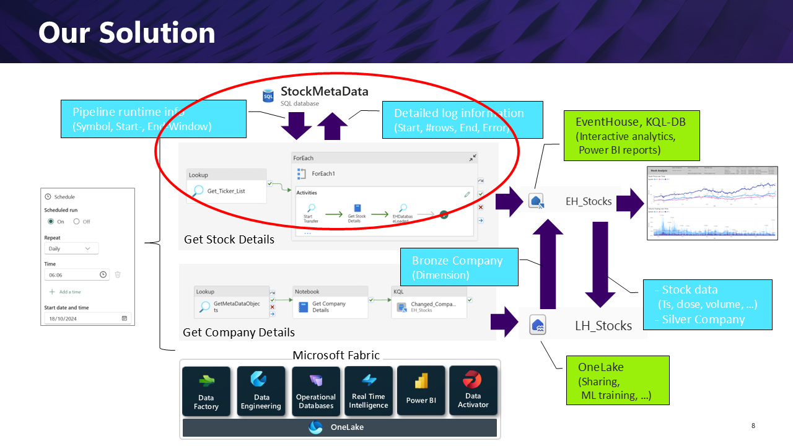

Key concepts in the implementation:
- Configuration of the pipeline is done outside of the pipeline
  - StockMetaData SQL database - tables
    - Optimal to store OLTP style data
- Avoid coding logic within the pipeline
  - StockMetaData SQL database – stored procedures
    - Logic can be implemented in an efficient way
    - Easy to debug
    - Can be reused in different pipelines

###  Fabric Pipeline '01 Get Stock Details'
This pipeline is responsible for getting the stock ticker data from the REST API. It fetches the stock details for a list of companies (list is coming from the SQL database) and stores the data in the Eventhouse. The notebook is fetching the data from the REST API, transforms it into JSON and stores it in the Eventhouse. The JSON format is used to show KQL magic in the Eventhouse. In a real project it is very often the case that the data is coming in JSON format. With this approach we can show how to handle JSON data in KQL.   
 
The pipeline is implemented in a way that it can be restarted without any data loss.  

Fabric Data Pipelines are used to orchestrate the workflow

Key concepts in the implementation:
- Configuration of the pipeline is done outside of the pipeline
  - StockMetaData SQL database - tables
    - Optimal to store OLTP style data
- Avoid coding logic within the pipeline
  - StockMetaData SQL database – stored procedures
    - Logic can be implemented in an efficient way
    - Easy to debug
    - Can be reused in different pipelines

###  StockMetaData Objects

The StockMetaData database contains just two relevant tables:
- TransferObject
  - Contains the list of companies for which the stock details should be fetched
- TransferLog
  - Contains the log information of the pipeline runs

The Business User can easily change the list of companies by updating the TransferObject table. The TransferLog table contains the log information of the pipeline runs.  

###  Handle data load windows, restart ability
The solution will fetch the stock details data in slices. It keeps track of the last fetched date and fetches the data from this date onwards. This way the pipeline can be restarted without any data loss.  
The implemented pattern can be used for «all» incremental loads with an increasing scalar (e.g. date) attribute.

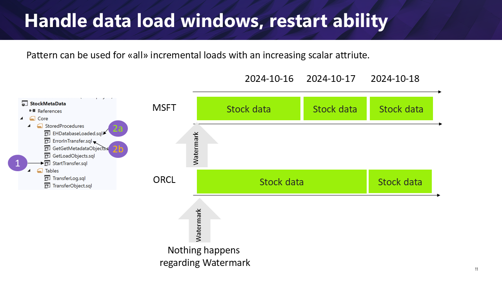

###  StockMetaData – Stored Procedures
A few, quite simple stored procedures provided the required transfer logic. 
- GetLoadObjects
  - Returns the list of companies for which the stock details should be fetched
- StartTransfer 
  - Logs in the meta data database that the transfer has started for a specific company and generates all time window related information for the pipeline to fetch the data from the REST API with the correct parameters.
- EHDatabaseLoaded
  - Logs in the meta data database that the data has been loaded into the Eventhouse for a specific company and adjusts the high watermark in the TransferObject table. 
- ErrorInTransfer
  - Logs in the meta data database that an error occurred during the transfer for a specific company.

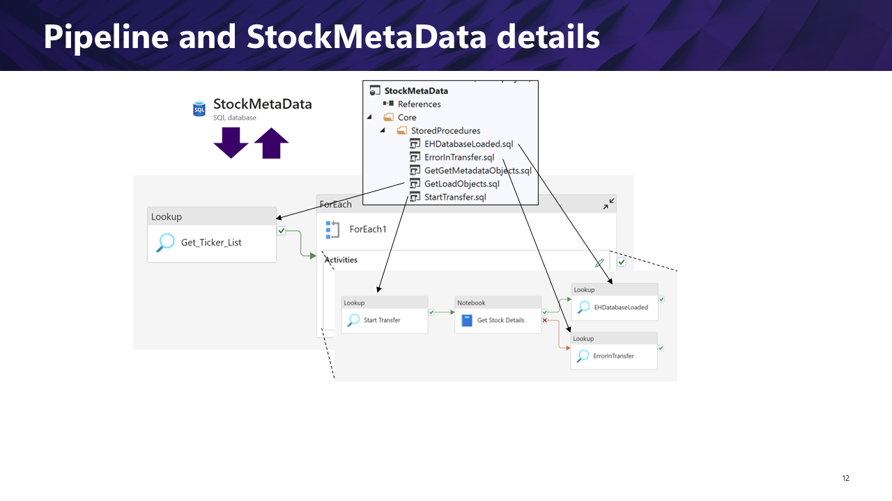

The code is developed as a SQL database project.

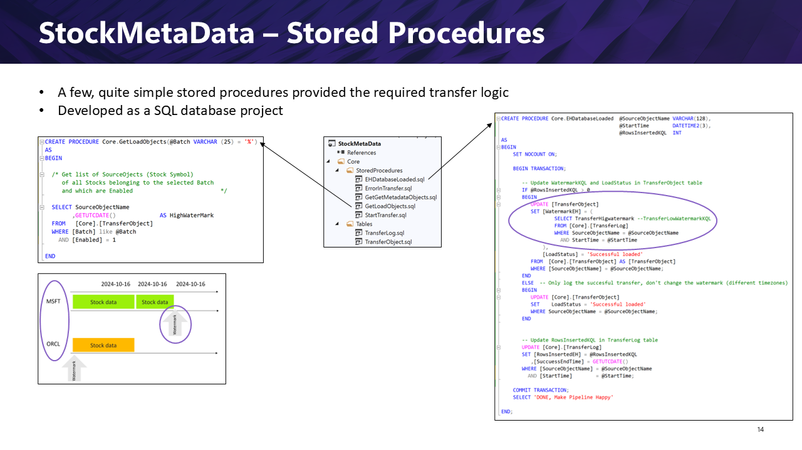

###  Eventhouse

####  JSON Parsing, Update Policy and Materialized Views
KQL is used to transform and clean the data (build the medallion architecture)

- Parse JSON
  - Define attributes and data types using KQL
- Move data from Bronze to Silver
  - KQL, user defined functions & update policy
- Build Gold Layer using Materialized views
  - Remove duplicate rows
  - Power BI data access functions

###  JSON Parsing 

With a few lines of KQL we can parse the JSON data and build the data structure required for the Silver layer.

###  Update Policy

An update policy is used to automate the process of moving data from the Bronze layer to the Silver layer. In a frst step the code must be wrapped in a function. The function is then used in the update policy.

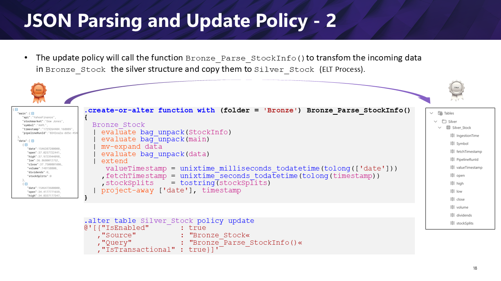

###  Remove Duplicate Rows
KQL functions arg_max()/take_any() and materialized-view are very helpful to remove duplicate rows.

- take_any() is used to remove duplicate rows if you are certain that the data is the same for all rows. 
- arg_max() is used to remove duplicate rows if you would like to control which row is taken. In our case we are using the last ingested row.

###  Notebook, Python Code – Get Stock Details

Reading the data from the REST API, transforming it into JSON and storing it in the Eventhouse is done in a Python notebook. The notebook is part of the pipeline and is triggered by the pipeline. 
  

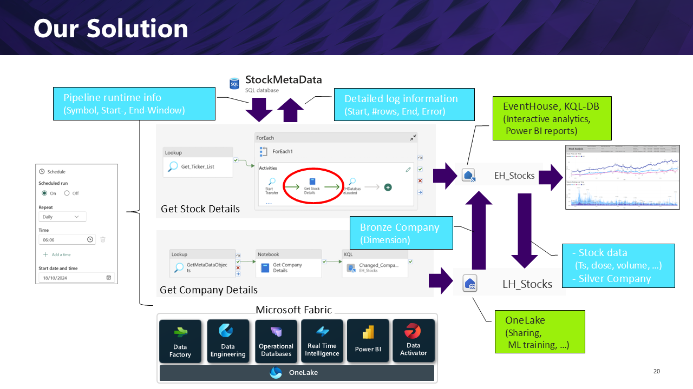

The notebook is embedded in the pipeline and it gets all the required parameters from the pipeline itself, getting the output from lookup activites. 
 

The Python code is quite simple. It reads the data from the REST API, transforms it into JSON and stores it in the Eventhouse.

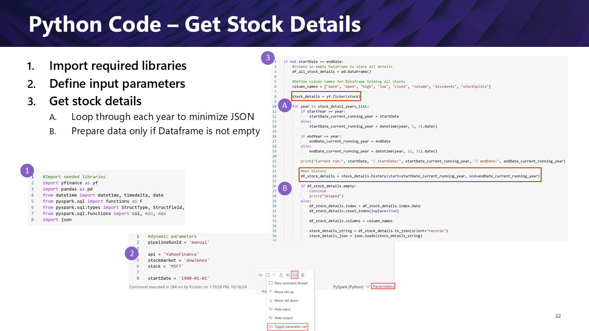

 

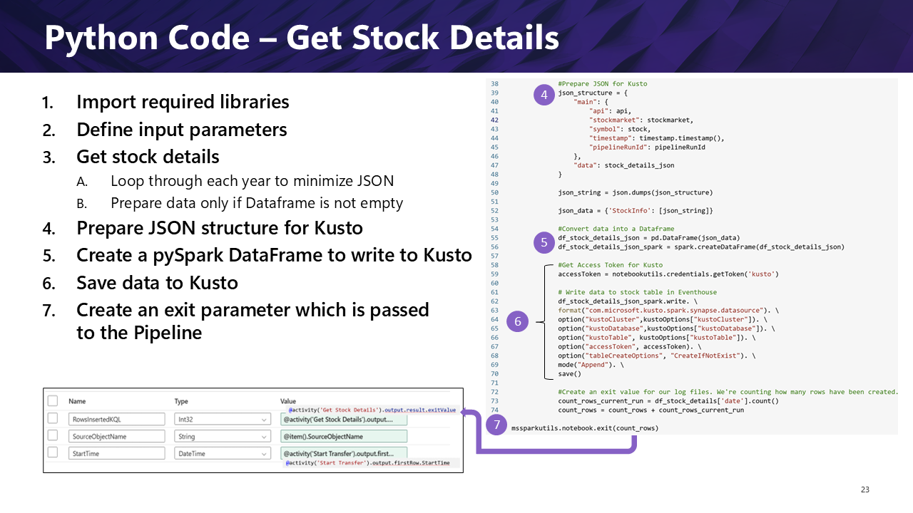

###  Python Code – Some notes
Very simple to pass parameter in and out
We specifically decided to convert data into JSON format for following reasons:
- Most IoT scenarios provide a JSON format
- Kusto is great in handling JSON format like no other tool
- Meta Data can be easily passed only once instead for each record
Bing combined with Copilot is giving outstanding support during development
Writing to Kusto is “a single line of code”
It’s not rocket science, but also not trivial as a few pitfalls can happen
  - JSON too large
  - Access Token expires
  - Keep naming convention
  - Implement incremental load (watermark)
  - Passing right parameter type
  - Understanding different formats (Dataframe, JSON), languages (Python, Pipeline Expressions), and technologies (Notebook, Pipelines)

###  Company Details Lakehouse
Company details are stored in a Lakehouse. 

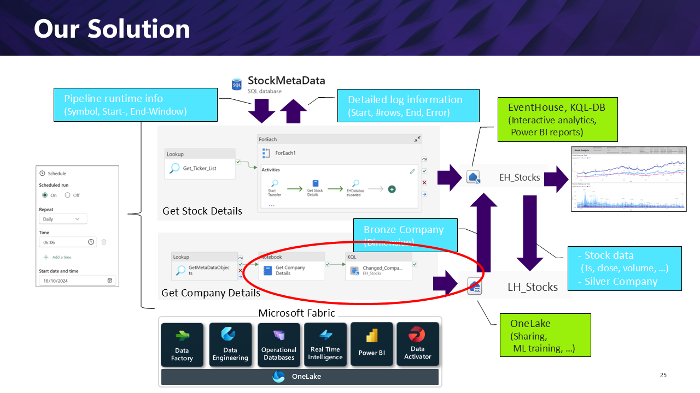

To make it accessible for the Eventhouse, a shortcut is created in Kusto. Kusto is also used to create a very simple version of an SCD2 dimension. If any attribute changes, a new record is created with the new attribute. 

The dimension is mirrored back to the Lakehouse.

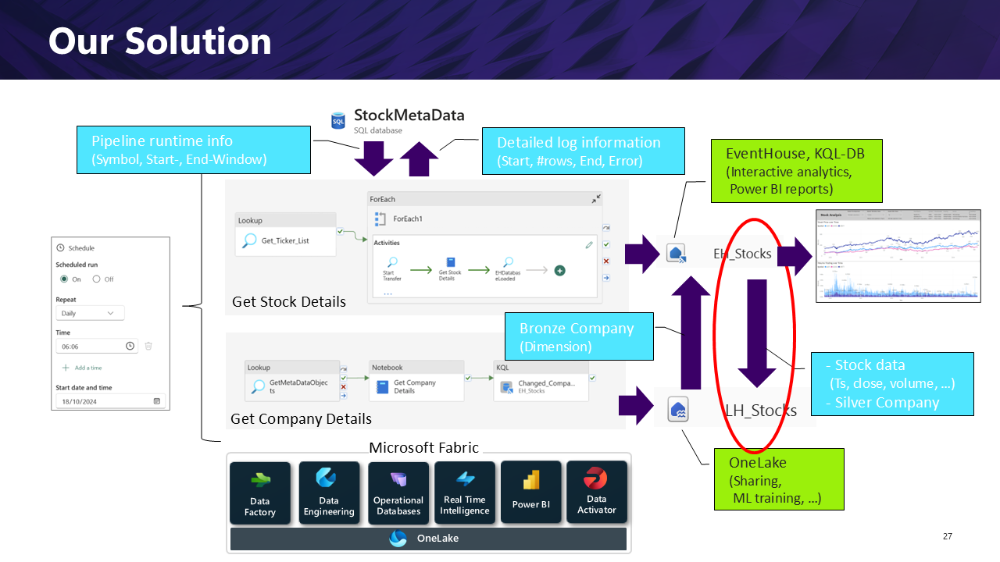

###  The performance “dilemma”

In an IoT scenario, the data is coming in real-time and the user would like to see the data in real-time. Delta parquet is more optimized for big datasets. If only a lakehouse is used, this can lead to a performance issue by having a lot of small files that need to be optimized. The solution is to use a KQL database for the real-time data and a lakehouse provides a nice architecture to be able to store the data in a more optimized way.

 

 

###  Data Access Facade

The Rest API provides just data for a corresponding company and point in time. Very often, the user would like to see the data over time, e.g. changes between two points in time, absolute or relative. The data access facade is used to provide the data in a way that the user can easily access the data over time.

  

But stock data is a little bit more complex. There are gaps in the time series data, over weekends or at bank holidays we will not get any data. The data access facade is used to fill the gaps in the data.

In our example we are using series_fill_forward() to fill the gaps in the data. But there are also other functions available to fill the gaps in the data.
- series_fill_forward()
- series_fill_backward()
- series_fill_linear()
- series_fill_const()
Depending on the use case, the right function can be used to fill the gaps in the data.

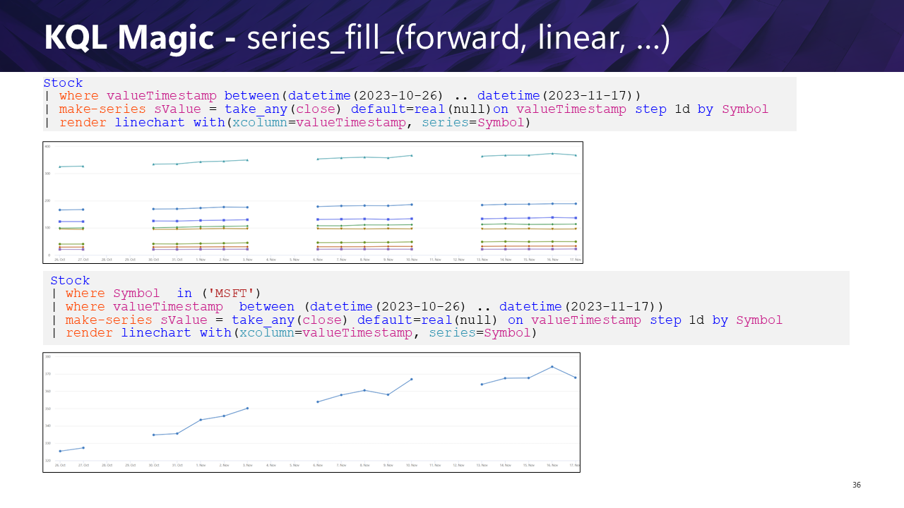

 

The series_fill_xxx() is only a subset of the available functions. There are also functions available to calculate the distance between two points, to check if a point is in a circle or polygon, to densify the shape edges, ...

 

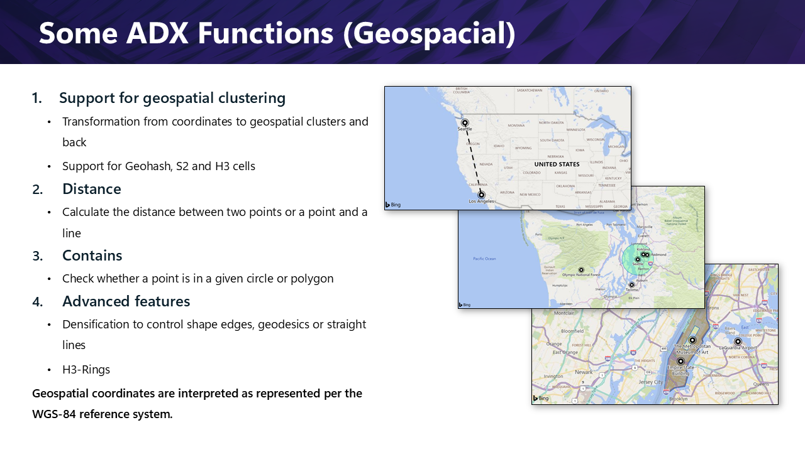

###  Power BI 

The Power BI report is used to analyze the stock data. The report is split into two pages. The overview page shows the stock price and the trading volume over time. The detailed analysis page shows the stock price changes over time. The user can select the companies the time frame and the bin size.

The Power BI dataset consists of 3 tables
- Dim_Company
- Dim_Company_Timestamp
- GetStock (Function)
Relationship between dim and fact tables created via “Symbol” column
Two helper Tables have been created to pass parameter directly to Kusto Query in M (PowerQuery) – no relationship created!
- Param_WindowSize
- Param_BinSize
- Param_Date

###  Overview Page M fact_GetStock

Details how to get data from the Eventhouse unsing the GetStock function and how to bind the parameters to the query.

Part 2:

Part 3:

###  Power BI – Parameter selection helper 
Slicer functionality is limited if you bind a field to a parameter and force single selection. Search functionality in Slicer Visual not available neither. As workaround use “pre-filters” like Year and Month.
To make the selection more transparent, a text field is used to provide the user with a better understanding of the selected value.

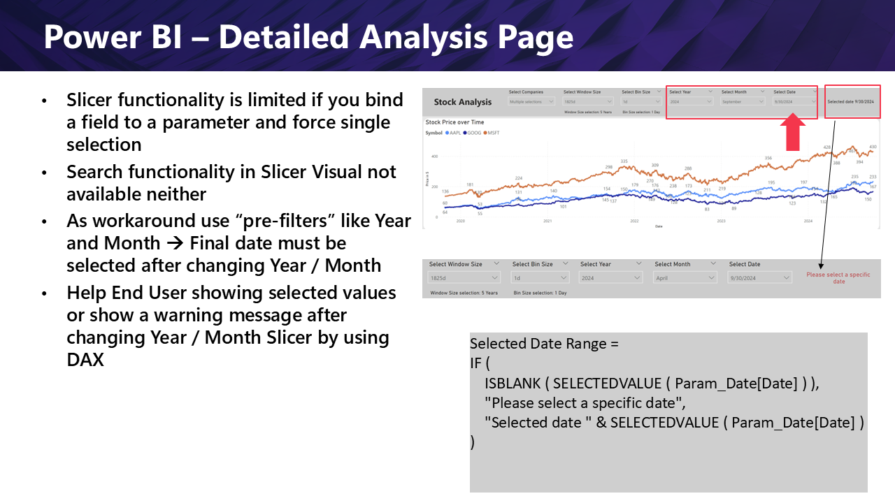

###  Power BI - Limit data in an efficient and flexible way

Power BI and any other BI tool is not designed to handle big data. At a certain point, the tables are getting to long or there are too many data points i a chart. To limit the data in an efficient and flexible way, a time window can be defined and data can be binned. 
 

To define the time window, two parameters are used, the end date of the time window (very often now) and the window width.
If this two parameters are provided, then KQL can be used to limit the data to the time window.

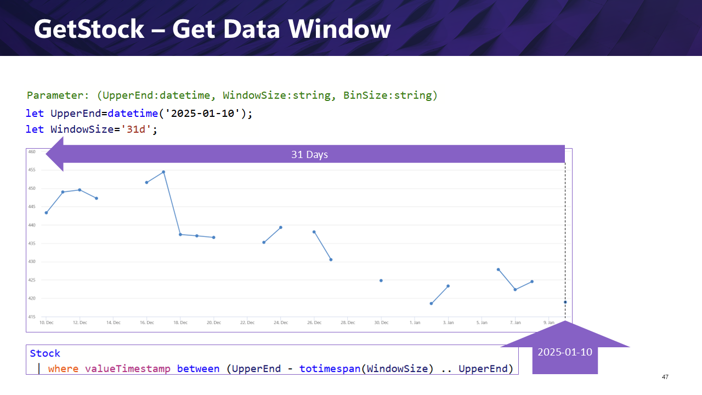

In a next step we can bin the data. The bin size can be defined in a parameter. The bin size can be used to bin the data in a way that the data is aggregated in the bin size. 
The first step is to fill the gaps in the data. Series_fill_forward() is used in our case.

If we are binning stock data, we have to consider how we aggregate up the data. In our example we are using the closing price of the stock in the corresponding bin window.

 
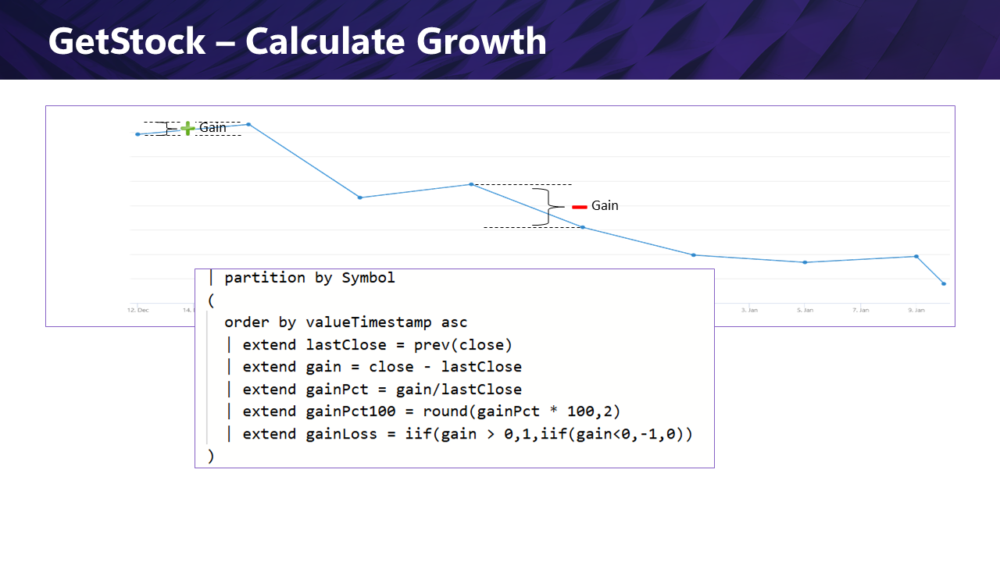

###  Schedule the pipeline

The pipeline is scheduled to run every day to get the stock details from the REST API. This can be done in the pipeline configuration. The pipeline is triggered by the schedule, but can also be triggered manually. 
If the pipeline is not started for some days, then the pipeline will fetch the data from the last fetched date onwards. If the pipeline is started multiple times a day, nothing will happen, because the pipeline is implemented in a way that it can be restarted without data duplication or any data loss.

##  Summary

Microsft Fabric provides all the building block to create an end to end soltuion in a efficient way. Because of the fact that Microsoft Fabric is a SaaS service, we can focus on the business logic and do not have to care about infrastructure setup, scaling, monitoring, ... Or configuring firewall rules, setting up a VPN, ...  
The solution is implemented in a way that it can be easily extended. For example, the data activator can be used to get informed if anomalies occur on stocks. The data activator can be used to trigger an alert if the stock price is changing more than 10% in a day.     

 

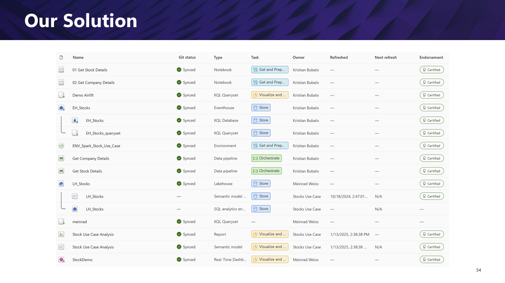

###  Conclusion

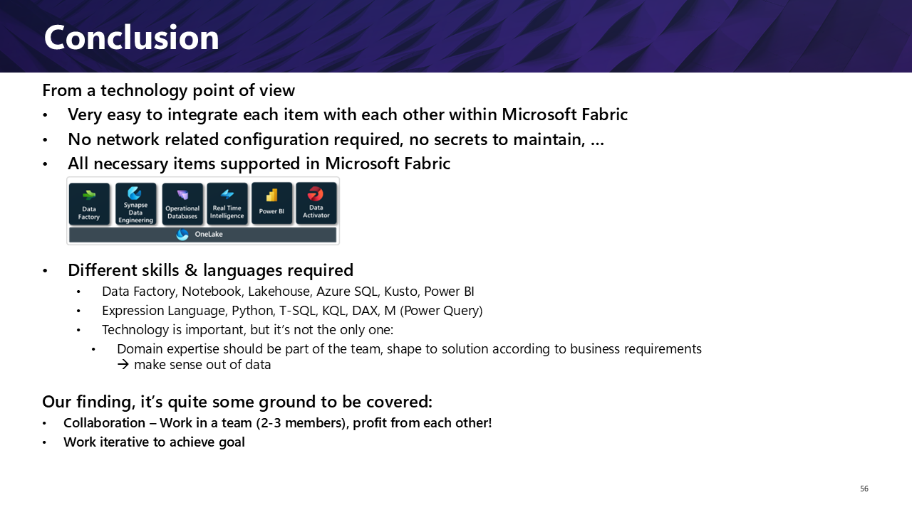

###  Thank you for your attention

## Next Steps

Implement Custom Endpoint and Event based ingestion

Use Accelerated shortcuts

Create a report with a real-time dashboard

Create a Data Activator to get informed if anomalies occur on stocks

Create a report with forecasting

